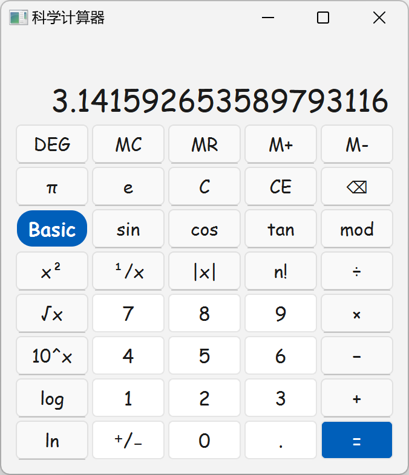

# 基于 Qt 的科学计算器

基于 Qt 框架的科学计算器，参考了 Windows 11 系统自带计算器程序的界面和功能设计

[项目实验报告](/实验报告.md)，可配合 Typora 及[仿 LaTeX 样式主题](https://github.com/Keldos-Li/typora-latex-theme)使用

## 功能演示

### 输入操作数功能演示

点击 `π` 按键：

### 一元运算功能演示

依次点击 `1`、`10^x`、`log`按键：

依次点击 `5`、`n!` 按键：

依次点击 `.`、`5`、`¹/x`、`⁺/₋` 按键：

### 三角函数功能演示

依次点击 `π`、`DEG`、`cos` 按键：

将 `Basic` 切换为 `Arc` 然后依次点击 `1`、`arctan` 按键：

### 二元运算功能演示

依次点击 `1`、`+`、`2`、`×`、`3`、`−`、`4`、`=` 按键：

依次点击 `2`、`.`、`5`、`⁺/₋`、`mod`、`2`、`=` 按键：

### 异常终止功能演示

<table style="border:none;text-align:center;width:auto;margin: 0 auto;">
    <tbody>
        <tr>
            <td></td>
            <td></td>
        </tr>
    </tbody>
</table>
