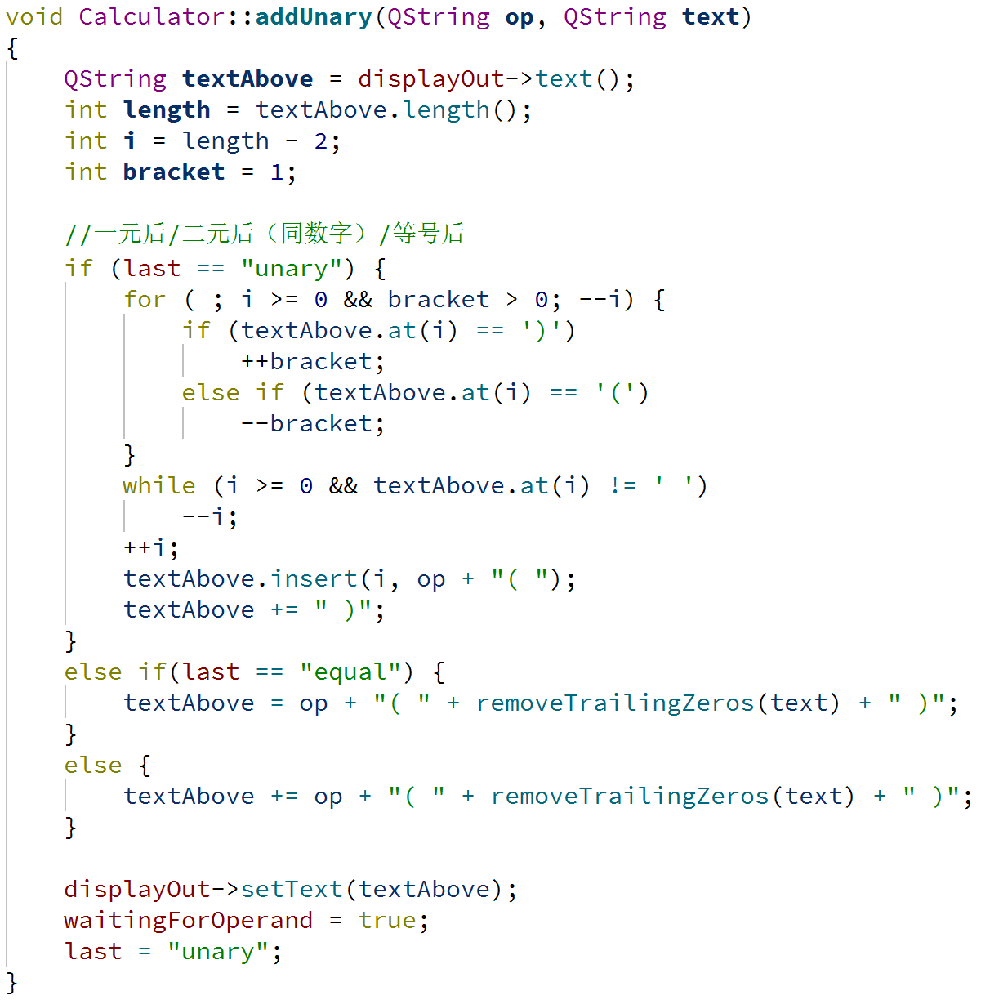
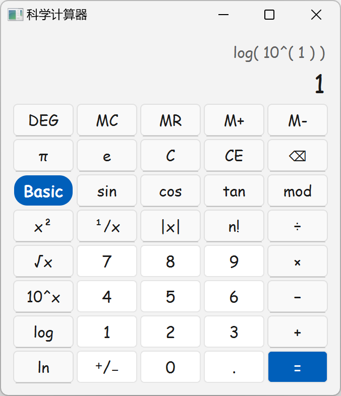
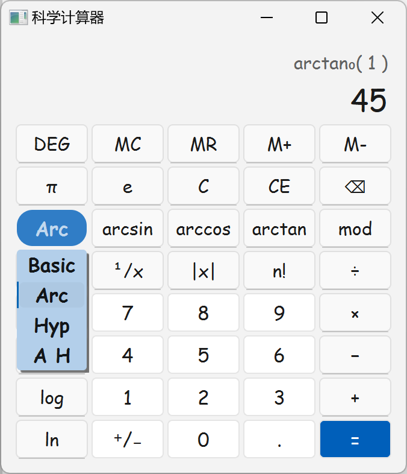
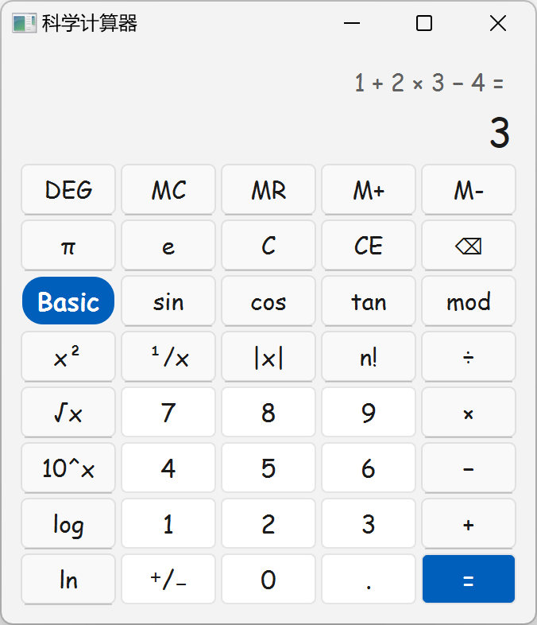
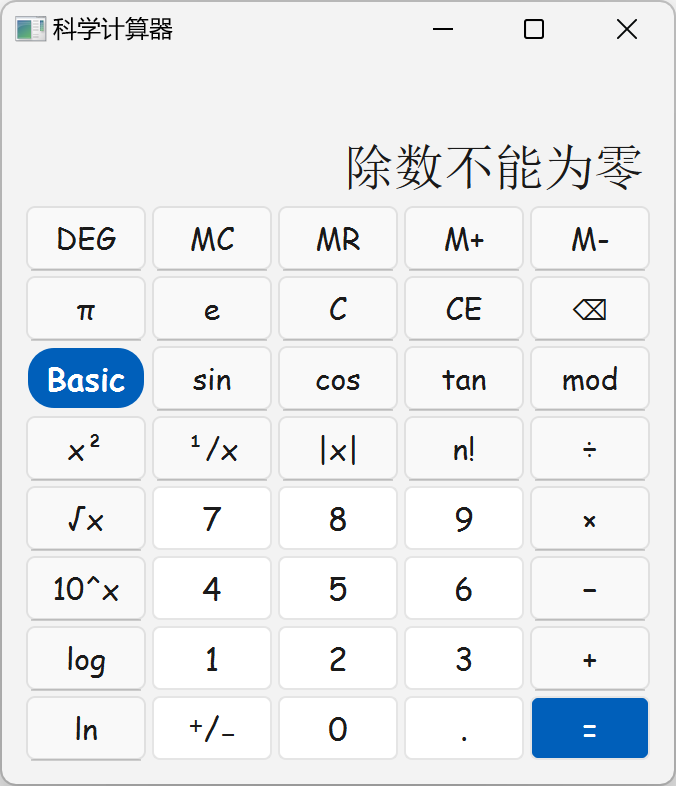

## 引言（Introduction）

在本项目中，我们的目标是开发一个科学计算器，该计算器不仅支持基本的数学运算，还提供乘方、开方、对数运算和三角函数等高级计算功能。该项目采用 C++ 语言和 Qt 框架进行实现，旨在利用 Qt 的强大功能和跨平台特性，打造一个用户友好、功能全面的计算器应用。该项目参考了 Windows 系统自带计算器 [^1] 科学板块的页面设计和功能实现以及 Qt 官方文档中的 Qt Widgets Calculator Example [^2]。

<strong>图 1-1 计算器初始界面</strong>

## 实验方法（Methodology）

### 实验环境

本项目的开发环境是 Qt Creator，这是一个专为 Qt 框架设计的跨平台集成开发环境（IDE）。Qt Creator 提供了代码编辑、UI 设计、调试程序等一系列功能，极大地简化了开发流程。

**Qt 框架介绍：**
Qt 是一个领先的跨平台应用开发框架，它支持桌面、移动、嵌入式等多个平台。Qt6 作为最新的主要版本，引入了大量新特性和架构上的改进，比如 Rendering Hardware Interface (RHI)，这是一个新的图形接口，提升了跨平台图形渲染的性能和灵活性。Qt 框架全面支持 C++17 并部分支持 C++20 标准，使得代码更简洁、性能更高。

**Qt Creator 功能：**
Qt Creator 是 Qt 公司提供的一个轻量级、功能强大的 IDE，它集成了项目模板生成、代码编辑、UI 设计、QML 界面编辑、调试程序、上下文帮助等功能。Qt Creator 的代码编辑器支持 C++ 和 QML，提供了语法高亮、代码折叠、自动补全等高级功能。此外，Qt Creator 还内置了调试器，允许开发者设置断点、检查变量和堆栈信息。Qt Creator 的高效构建系统支持不同的编译器和平台，使得应用程序的构建和部署更加便捷。

**Qt Creator 与 Qt 框架的关系：**
Qt Creator 与 Qt 框架紧密集成，专为 Qt 开发设计，使得管理和部署 Qt 应用程序变得更加容易。Qt Creator 提供了对 Qt6 新特性的支持，并提供了更强大的代码编辑和调试工具。

通过使用 Qt Creator 和 Qt 框架，本项目能够实现一个功能丰富、操作简便的科学计算器，同时保证了代码的高效性和应用程序的跨平台兼容性。

### 功能实现

项目中共使用了两个类，分别是：

- **Button：**继承自 `QToolButton`，实现计算器中每个按钮的功能；

- **Calculator：**继承自 `QWidget`，实现整个计算器的主体功能，在 `main.cpp` 中对其进行实例化并调用 `show()` 方法显示主界面。

首先在 Button 类和 Calculator 类构造函数部分对整个计算器界面进行了初始化，具体实现如下：

#### 创建所有按钮并连接对应的槽函数和快捷键

1. 在 `calculator.h` 中声明所有按钮和相应的槽函数。

    <table style="border:none;text-align:center;width:auto;margin: 0 auto;">
        <tbody>
            <tr>
                <td></td>
                <td></td>
            </tr>
            <tr>
                <td><strong>图 2.2.1-1  calculator.h 中的按钮声明（部分）</strong></td>
                <td><strong>图 2.2.1-2  calculator.h 中的槽函数声明</strong></td>
            </tr>
        </tbody>
    </table>

2. 在 `calculator.h` 中声明创建按钮并连接槽函数的函数 `createButton()` 和创建快捷键的函数 `createShortcut()`，并在 `calculator.cpp` 中实现。

    
    
    
<strong>图 2.2.1-3 calculator.h 中的创建按钮和快捷键函数声明</strong>

    

    
<strong>图 2.2.1-4 calculator.cpp 中的创建按钮和快捷键函数实现</strong>

3. 在 `calculator.cpp` 的构造函数中调用 `createButton()` 和 `createShortcut()` 函数创建所有按钮和快捷键。

    <table style="border:none;text-align:center;width:auto;margin: 0 auto;">
        <tbody>
            <tr>
                <td></td>
                <td></td>
            </tr>
            <tr>
                <td><strong>图 2.2.1-5  calculator.cpp 构造函数中的按钮创建（部分）</strong></td>
                <td><strong>图 2.2.1-6  calculator.cpp 构造函数中的快捷键创建（部分）</strong></td>
            </tr>
        </tbody>
    </table>

#### 使用 `QComboBox` 和 `QStackedWidget` 配合实现三角函数按钮部分的切换功能

1. 在 `calculator.h` 中声明相应的控件。
   
   
   
   
<strong>图 2.2.2-1 calculator.h 中的三角函数切换控件声明</strong>

   
2. 在 `calculator.cpp` 构造函数中初始化并将三角函数按钮加入堆叠控件中。

   初始化下拉菜单时使用了 `model` 设置下拉菜单的格式使文字居中显示。[^3]

   

   
<strong>图 2.2.2-2 calculator.cpp 构造函数中下拉菜单和堆叠控件的初始化</strong>

3. 在 `calculator.cpp` 构造函数中连接下拉菜单索引和堆叠按钮的切换。
   
   
   
   
<strong>图 2.2.2-3 calculator.cpp 构造函数中连接下拉菜单和堆叠控件的切换</strong>

#### 设置按钮和下拉菜单样式

1. 在 `button.cpp` 的构造函数中统一设置所有按钮的默认样式。

2. 在 `calculator.cpp` 的构造函数中单独设置数字键、小数点、正负切换键、等号键和下拉菜单的样式。

   想使背景色生效，要设置一个 `border` 属性，因为 `QToolButton` 和 `QPushButton` 的原生边界把背景色给覆盖住了。[^4]

   <table style="border:none;text-align:center;width:auto;margin: 0 auto;">
       <tbody>
           <tr>
               <td></td>
               <td></td>
           </tr>
           <tr>
               <td><strong>图 2.2.3-1  button.cpp 构造函数中设置默认样式</strong></td>
               <td><strong>图 2.2.3-2  calculator.cpp 构造函数中设置等号键样式</strong></td>
           </tr>
       </tbody>
   </table>
   <table style="border:none;text-align:center;width:auto;margin: 0 auto;">
       <tbody>
           <tr>
               <td></td>
               <td></td>
           </tr>
           <tr>
               <td><strong>图 2.2.3-3  calculator.cpp 构造函数中设置数字键样式</strong></td>
               <td><strong>图 2.2.3-4  calculator.cpp 构造函数中设置下拉菜单样式</strong></td>
           </tr>
       </tbody>
   </table>

#### 创建输入输出框并设置样式

1. 在 `calculator.h` 中声明输入输出框。

2. 在 `calculator.cpp` 构造函数中初始化并设置样式。

   

   
<strong>图 2.2.4-1 calculator.cpp 构造函数中初始化输入输出框并设置样式</strong>

#### 将输入输出框和所有按钮加入布局中

<strong>图 2.2.5-1 calculator.cpp 构造函数中初始化布局并将输入输出框和所有按钮加入布局（部分）</strong>

#### 声明运算过程和输入输出显示需要的状态变量并进行初始化

其中 `memory` 储存记忆功能的值；`sumSoFar` 储存加减运算的临时值；`factorSoFar` 存储乘除和取模运算的临时值；`pendingAdditiveOperator` 存储等待计算的加减运算符；`pendingMultiplicativeOperator` 存储等待计算的乘除或取模运算符；`waitingForOperand` 为 true 时表示当前输入框显示的不是用户输入的操作数，当用户点击输入按钮时要先清零；`last` 存储上一步点击的按钮执行的操作，便于输出框显示格式的调整。这些变量在重置计算器操作时（即 `clearAll()` 函数中）也需要重置。

<table style="border:none;text-align:center;width:auto;margin: 0 auto;">
    <tbody>
        <tr>
            <td></td>
            <td></td>
        </tr>
        <tr>
            <td><strong>图 2.2.6-1  calculator.h 变量声明</strong></td>
            <td><strong>图 2.2.6-2  calculator.cpp 构造函数中变量初始化</strong></td>
        </tr>
    </tbody>
</table>

之后在 `calculator.cpp` 文件中对所有按钮对应的槽函数和其他相关函数进行实现，具体可分为输入操作数（数字、小数点、π 和 e 常数）、一元运算（包含稍有差异的正负切换和三角函数）、二元运算（包含点击等号键）、删除、记忆五个类别，具体实现如下：

#### 输入操作数功能实现

1. 点击数字键后，根据状态变量执行相应删除操作，避免显示多余的 0 和输入框显示超过长度，将输入框中内容去掉逗号分隔符并加上点击的数字，然后重新格式化(2.2.12)并显示，最后更新状态变量。

   

   
<strong>图 2.2.7-1 calculator.cpp 点击数字键槽函数实现</strong>

2. 点击小数点和常数键后，执行类似的操作，在输入框内容后加上小数点或将输入框内容设置为相应的常数。需要注意的是，在点击常数键后 `waitingForOperand` 变量的值仍然设为 `true`，这样再输入其他值前就会先清零。

   

   
<strong>图 2.2.7-2 calculator.cpp 点击小数点和常数键槽函数实现</strong>

#### 一元运算功能实现

一元运算功能实现涉及到的函数有点击基本一元运算符 `unaryOperatorClicked()`、点击正负切换键 `changeSignClicked()`、点击三角函数运算符 `trigonometricClicked()` 和点击弧度角度切换键 `unitClicked()` 四个槽函数，以及向输出框中添加一元运算符和操作数组合格式文本的 `addUnary()` 函数和对应的 `removeUnary()` 函数。由于一元运算只需要一个操作数，且在点击运算符时操作数已被输入并显示在输入框中，因此点击运算符后就可以直接计算并显示运算结果。

1. 点击基本一元运算符后，从输入框获取操作数并根据运算符进行相应的运算，需要注意判断异常终止(2.2.13)的情况，最后在输入行显示格式化(2.2.12)后的运算结果，并调用 `addUnary()` 函数。

   <table style="border:none;text-align:center;width:auto;margin: 0 auto;">
       <tbody>
           <tr>
               <td></td>
               <td></td>
           </tr>
           <tr>
               <td><strong>图 2.2.8-1  calculator.cpp 点击一元运算符函数实现（开头部分）</strong></td>
               <td><strong>图 2.2.8-2  calculator.cpp 点击一元运算符函数实现（结尾部分）</strong></td>
           </tr>
       </tbody>
   </table>

2. 点击正负切换键后，只需在输入行不为 0 时在开头添加或删除 `-` 号，输出行为空时不需要调用 `addUnary()` 函数。

3. 点击三角函数运算符后，在一元运算符的基础上还需要获取当前弧度角度切换键显示的内容，判断是否需要进行弧度角度转换（`cmath` 中三角函数相关计算函数的参数都以弧度作为单位），注意使用角度作为单位的反函数运算应该在调用函数计算后再将结果（此时为弧度值）转换为角度值。

4. 弧度角度切换键的实现直接设置按钮显示文本为另一个即可。

   <table style="border:none;text-align:center;width:auto;margin: 0 auto;">
       <tbody>
           <tr>
               <td></td>
               <td></td>
               <td></td>
           </tr>
           <tr>
               <td><strong>图 2.2.8-3 calculator.cpp 点击正负切换键函数实现</strong></td>
               <td><strong>图 2.2.8-4 calculator.cpp 点击三角函数运算符函数实现（部分）</strong></td>
               <td><strong>图 2.2.8-5 calculator.cpp 点击弧度角度切换键函数实现</strong></td>
           </tr>
       </tbody>
   </table>

5. 计算结束后应向输出框的显示文本中添加对应的一元运算符，并在括号内显示操作数的表达式，这里需要对上一步同样点击的是一元运算符的情况单独处理，此时括号内应该包含完整的上一步的一元运算符和操作数组合格式文本，其他情况括号内直接显示操作数即可。

6. 在一元运算后如果直接修改输入框显示内容，包括输入操作数(2.2.7)、重置操作数(2.2.10)、记忆清零(2.2.11)，需要同步删除输出框中的一元运算符和操作数组合格式文本。

   <table style="border:none;text-align:center;width:auto;margin: 0 auto;">
       <tbody>
           <tr>
               <td></td>
               <td></td>
           </tr>
           <tr>
               <td><strong>图 2.2.8-6  calculator.cpp 添加一元运算符函数实现</strong></td>
               <td><strong>图 2.2.8-7  calculator.cpp 删除一元运算符函数实现</strong></td>
           </tr>
       </tbody>
   </table>

#### 二元运算功能实现

二元运算功能实现涉及到的函数有点击加法运算符 `additiveOperatorClicked()`、点击乘法运算符 `multiplicativeOperatorClicked()`  和点击等号键 `equalClicked()` 三个槽函数，以及进行计算的 `calculate()` 函数和实现 `double` 类型变量取模运算的 `mod()` 函数。

二元运算功能需要两个操作数，点击运算符后无法直接计算。左操作数存储在 `sumSoFar` 和 `factorSoFar` 变量中，运算符存储在`pendingAdditiveOperator` 和 `pendingMultiplicativeOperator` 变量中。由于运算符优先级不同，先乘除后加减，因此在不点击等号键的情况下，点击任意二元运算符时进行前一个乘法（包括除法、取模）运算的计算，点击加法运算符时，在此基础上还要进行前一个加法（包括减法）运算的计算，点击等号键时计算所有结果。

下表显示了用户输入一个四则运算表达式时输入输出框和各状态变量的变化过程：

| User Input | Display In | Display Out | Sum so Far | Add. Op. | Factor so Far | Mult. Op. | Waiting for Operand |
| --------------- | - | --------------- | - | - | - | - | ----- |
|                 | 0 |                 |   |   |   |   | true  |
| 1               | 1 |                 |   |   |   |   | false |
| 1 +             | 1 | 1 +             | 1 | + |   |   | true  |
| 1 + 2           | 2 | 1 +             | 1 | + |   |   | false |
| 1 + 2 ×         | 2 | 1 + 2 ×         | 1 | + | 2 | × | true  |
| 1 + 2 × 3       | 3 | 1 + 2 ×         | 1 | + | 2 | × | false |
| 1 + 2 × 3 -     | 7 | 1 + 2 × 3 -     | 7 | - |   |   | true  |
| 1 + 2 × 3 - 4   | 4 | 1 + 2 × 3 -     | 7 | - |   |   | false |
| 1 + 2 × 3 - 4 = | 3 | 1 + 2 × 3 - 4 = |   |   |   |   | true  |

1. 对状态变量实现具体的加减乘除和取模运算，注意判断除数为零的情况并进行异常处理(2.2.13)。

   

   
<strong>图 2.2.9-1 calculator.cpp 二元计算函数实现</strong>

2. 取模运算符 `%` 不适用于 `double` 类型变量，需要单独定义一个 `double` 类型取模函数。

   

   
<strong>图 2.2.9-2 calculator.cpp double 类型取模函数实现</strong>

3. 点击等号后依次对乘法运算符和加法运算符进行处理，最后格式化(2.2.12)进行输出显示。

   

   
<strong>图 2.2.9-3 calculator.cpp 点击等号键函数实现</strong>

4. 点击加法运算符后操作与点击等号后基本一致，只需对连续点击多个二元运算符进行切换的情况单独处理。

5. 点击乘法运算符后不需要处理加法运算符，但也需要对连续点击多个二元运算符进行切换的情况单独处理。

   <table style="border:none;text-align:center;width:auto;margin: 0 auto;">
       <tbody>
           <tr>
               <td></td>
               <td></td>
           </tr>
           <tr>
               <td><strong>图 2.2.9-4  calculator.cpp 点击加法运算符函数实现（切换运算符处理部分）</strong></td>
               <td><strong>图 2.2.9-5  calculator.cpp 点击乘法运算符函数实现（切换运算符处理部分）</strong></td>
           </tr>
       </tbody>
   </table>

#### 删除功能实现

删除功能部分包括击退格键 `backspaceClicked()`、重置操作数 `clear()` 和重置整个计算器 `clearAll()` 三个槽函数。

<table style="border:none;text-align:center;width:auto;margin: 0 auto;">
    <tbody>
        <tr>
            <td></td>
            <td></td>
            <td></td>
        </tr>
        <tr>
            <td><strong>图 2.2.10-1 calculator.cpp 点击退格键函数实现</strong></td>
            <td><strong>图 2.2.10-2 calculator.cpp 重置操作数函数实现</strong></td>
            <td><strong>图 2.2.10-3 calculator.cpp 重置计算器函数实现</strong></td>
        </tr>
    </tbody>
</table>

#### 记忆功能实现

记忆功能部分包括记忆清零（MC） `clearMemory()`、记忆读取（MR） `readMemory()`、加入到记忆（M+） `addToMemory()` 和从记忆减去（M−） `substractFromMemory()` 四个槽函数，由于记忆设置（MS）功能可以由记忆清零（MC）和加入到记忆（M+）两个功能组合完成，所以省略掉了该按钮和对应的功能实现。

<table style="border:none;text-align:center;width:auto;margin: 0 auto;">
    <tbody>
        <tr>
            <td></td>
            <td></td>
            <td></td>
        </tr>
        <tr>
            <td><strong>图 2.2.11-1 calculator.cpp 记忆清零函数实现</strong></td>
            <td><strong>图 2.2.11-2 calculator.cpp 记忆读取函数实现</strong></td>
            <td><strong>图 2.2.11-3 calculator.cpp 加入到记忆和从记忆减去函数实现</strong></td>
        </tr>
    </tbody>
</table>

`Calculator.cpp` 文件中还有一些其他通用函数的实现，包括输入输出框显示内容的格式化、运算异常终止处理，具体实现如下：

#### 显示格式化相关函数实现

这部分包括去掉小数末尾零 `removeTrailingZeros()`、对 `QString` 类型数格式化 `QStringdigitFormat()` 和对 `double` 类型数格式化 `DoubledigitFormat()` 三个函数，在多个涉及到在输入输出框中显示数功能的函数中都有被调用。

<strong>图 2.2.12-1 calculator.cpp 去掉小数末尾零函数实现</strong>

<table style="border:none;text-align:center;width:auto;margin: 0 auto;">
    <tbody>
        <tr>
            <td></td>
            <td></td>
        </tr>
        <tr>
            <td><strong>图 2.2.12-2  calculator.cpp QString 类型数格式化函数实现</strong></td>
            <td><strong>图 2.2.12-3  calculator.cpp double 类型数格式化函数实现</strong></td>
        </tr>
    </tbody>
</table>

#### 运算异常终止处理实现

这部分用于对除数为零或其他运算异常终止的情况进行表示。

<strong>图 2.2.13-1 calculator.cpp 运算异常终止处理</strong>

## 实验结果（Results）

下面通过计算器界面截图进行功能演示。

### 输入操作数功能演示

点击 `π` 按键：

### 一元运算功能演示

依次点击 `1`、`10^x`、`log`按键：

依次点击 `5`、`n!` 按键：

依次点击 `.`、`5`、`¹/x`、`⁺/₋` 按键：

### 三角函数功能演示

依次点击 `π`、`DEG`、`cos` 按键：

将 `Basic` 切换为 `Arc` 然后依次点击 `1`、`arctan` 按键：

### 二元运算功能演示

依次点击 `1`、`+`、`2`、`×`、`3`、`−`、`4`、`=` 按键：

依次点击 `2`、`.`、`5`、`⁺/₋`、`mod`、`2`、`=` 按键：

### 异常终止功能演示

<table style="border:none;text-align:center;width:auto;margin: 0 auto;">
    <tbody>
        <tr>
            <td></td>
            <td></td>
        </tr>
    </tbody>
</table>

## 分析和讨论（Analysis and Discussion）

### 结果分析

本项目成功实现了一个功能齐全的科学计算器，它不仅包括基本的算术运算，还支持乘方、开方、对数和三角函数等高级数学运算。这些功能的实现满足了项目的主要目标，即提供一个用户友好的界面，使进行复杂计算变得简单快捷。通过使用 Qt 框架，创建一个简洁美观的科学计算器，同时还确保了跨平台兼容性。

### 问题和限制

该科学计算器目前存在的问题和不足有：数学运算的精度不够，特别是涉及到浮点数的运算，超过 20 的数的阶乘计算结果有误，可以将运算中使用的数据类型更换为精度更高的 `long double` 型；异常终止后没有设置标识，可能导致输出行显示混乱；可以将 CE 和 C 键合并显示；没有倒数三角函数 sec、csc、cot 等运算；二元运算功能模块没有包含更高一级的乘方、开方和对数运算；没有括号；没有手动切换科学计数法表示功能；没有计算和记忆功能的历史记录等。

### 用户体验

该计算器设计考虑了用户体验，提供了直观的按钮布局和清晰的显示屏。用户可以轻松地输入表达式并获取结果，无需深入理解底层的数学原理。还提供了撤销和清除等其他功能，以便用户可以轻松纠正错误。根据用户反馈，计算器的操作直观且响应迅速，但有些用户建议增加更多的功能，如括号和二元乘方运算。

## 结论（Conclusion）

### 项目总结

项目的成功点在于实现了一个功能全面、用户界面友好的科学计算器。该计算器不仅实现了基本的数学运算，还成功集成了高级数学功能，如三角函数。该计算器的用户界面的设计简洁美观，使得用户能够轻松使用。

### 未来工作

基于用户反馈和项目评估，未来有以下几个可能的改进方向：

1. 增加更多数学函数：包括倒数三角函数、二元乘方、开方和对数运算，以满足更广泛的用户需求。

2. 增强计算功能：考虑使用堆栈和递归的逻辑实现对用户输入的带括号的表达式进行计算。

3. 优化用户界面：比如将 CE 和 C 键合并显示，添加计算和记忆功能的历史记录显示。

4. 扩展平台支持：探索将计算器移植到移动平台，如 Android 和 iOS，以扩大用户群体。

[^1]: https://github.com/Microsoft/calculator Windows Calculator
[^2]: https://doc.qt.io/qt-6/qtwidgets-widgets-calculator-example.html Qt Widgets Calculator Example
[^3]: https://blog.csdn.net/qq_34305316/article/details/96488636 QComboBox 中文字和下拉项居中
[^4]: https://blog.csdn.net/qq_31073871/article/details/79965015 QT 样式表设置背景色 background-color 无效的原因
